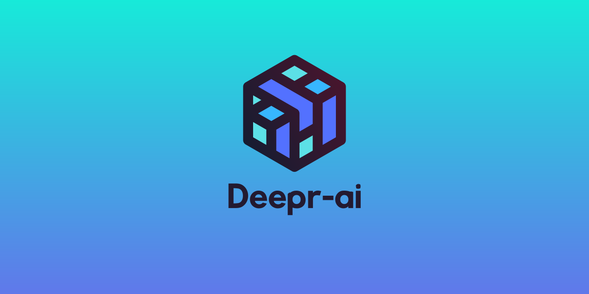

## What is Deepr-ai?
Deeper-ai is a beginner-friendly neural network libary developed in Python and Cython, which aims to be simple and easy to use. Deepr-ai is made for a level 0 introduction to machine learning, helping others to gain a firm understanding of the core concepts and to prepare them for more advanced frameworks (which deepr-ai might make in the future).
## Documentation
The documentation for Deepr-ai is still under construction, but you can check it out here:
https://docs.deepr.dev/books/deeprai-docs
## What makes Deepr-ai diffrent from other machine learning libraries?
Deepr-ai's incredibly easy and simple setup means that it requires almost no previous knowledge in Python, math, or machine learning to set up a model. However, there are more advanced settings as well (for more experienced users).
## Is Deepr-ai finished?
Currently, Deepr-ai is under devopment. Regular updates are planned (granted im in highschool so updates might be delayed). However, Deepr-ai still has useful features and practical uses in its unfinished form. 

Copyright 2023 Kieran Carter

